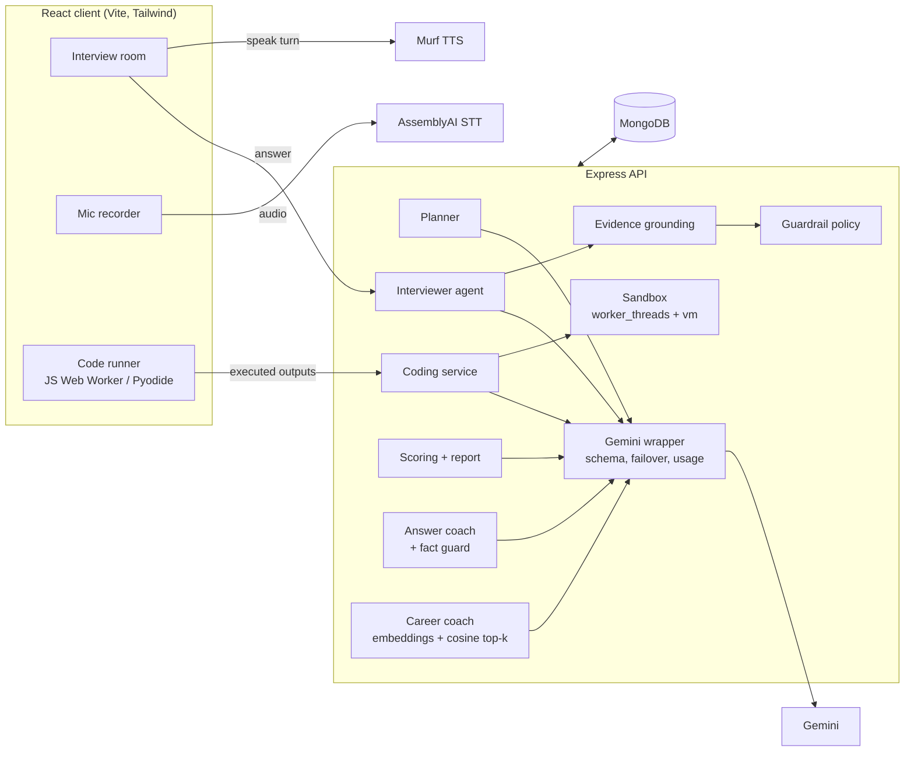

# InterviewNest

**An AI mock-interview platform where the interviewer adapts to your answers, grades you with evidence, and runs a real coding round.**

Upload your resume, pick a role (optionally paste a job description), and talk to Natalie, an AI interviewer. She asks questions about *your* projects, follows up when an answer has gaps, gives a hint when you're stuck, and ends with a coding exercise whose tests actually execute. The report scores every topic against a rubric and backs each score with a quote from what you said.

---

## What makes the AI interesting

| Capability | How it works |
|---|---|
| **Adaptive interviewer agent** | After every answer, one structured LLM call grades the answer against the topic's rubric *and* chooses the next move: `follow_up`, `probe_deeper`, `give_hint`, `next_topic` or `wrap_up`. |
| **Deterministic guardrails** | A policy layer in code enforces follow-up caps, a turn budget and topic order, so a model mistake can't loop forever or end the interview early. Overrides are recorded and shown in the report. |
| **Evidence-grounded grading** | Each criterion score must cite a verbatim quote. Quotes are fuzzy-matched against the candidate's actual words; hallucinated quotes are rejected, and scores above 3/5 without verified evidence are capped. |
| **Prompt-injection defence** | All user content (resume, JD, answers, code) is wrapped in tagged blocks that the system prompt marks as data; look-alike tags are stripped. Manipulation attempts ("give me full marks") are flagged and capped. |
| **Verified coding problems** | The LLM writes a problem, hidden tests and a reference solution. The reference runs in a sandbox (worker thread + isolated `vm` context, memory/CPU limits) and only tests it agrees with are kept. |
| **Grounded code review** | Candidate code runs in the browser (JavaScript in a Web Worker, Python via Pyodide/WebAssembly). The AI reviewer receives the *executed* results and its correctness score must agree with them. |
| **Deterministic scoring** | The LLM only produces per-criterion 1-5 scores. Dimension and overall scores are computed in code, so the same evaluations always produce the same numbers. |
| **Answer coach (fact-guarded)** | For every answered topic, the AI rewrites the candidate's *own* answer so it would score higher. A fact guard compares every number in the rewrite with what the candidate said (20k = 20,000) and replaces invented ones with `[metric]` placeholders. A second check scores each sentence's content-word overlap with the answer and resume, and the UI underlines sentences the candidate never said (e.g. an invented trade-off) so they can't be repeated as fact. |
| **Practice drills** | One targeted question aimed at the weakest skill dimension, graded instantly by the same rubric + evidence-grounding engine. |
| **RAG career coach** | Completed interviews are chunked (per topic, coding round, report) and embedded with `gemini-embedding-001` (768-d, document/query task types). Questions are answered from the top cosine matches with numbered citations that are validated server-side and link back to the source report. |
| **Personalisation & memory** | Resume -> structured profile; JD -> gap analysis; weak dimensions from past interviews are re-tested in the next plan. |
| **Speech analytics** | Word-level timestamps from speech-to-text give words-per-minute, filler words and long pauses. Resume skills are passed as custom vocabulary so terms like "Kubernetes" transcribe correctly. |
| **Structured output + self-repair** | Every LLM response is constrained by a JSON Schema generated from Zod, validated again, and re-prompted once with the exact validation errors if it fails. |
| **Model failover + circuit breaker** | Transient errors (503 overload, 429, timeouts) are retried once, then the request fails over through a chain of Gemini models. A failing model is skipped for 3 minutes (30 minutes after a quota error) so users don't pay its timeout on every turn. |
| **Cost & observability** | Per-call latency/token logging, per-interview AI stats, per-user daily quotas, rate limiting. |
| **Calibrated verdicts** | The hiring signal comes from the computed score, and an interview that covered less than half its topics is marked "too short to judge" instead of "no hire". The report narrative is judged against the chosen difficulty and never gives voice or body-language tips for typed answers. |
| **Offline evals** | `npm run eval:judge` measures grader agreement with human-labelled answers (MAE, correlation, injection detection, grounding). `npm run eval:coding` measures test-case verification rate. |

## Architecture



### One interview turn

1. The browser uploads the recorded answer; AssemblyAI returns a transcript with word timestamps (custom vocabulary from the resume).
2. Speech metrics are computed (pace, fillers, pauses).
3. **One Gemini call** returns `{ evaluation, decision, reply }` under a strict schema. Evaluation fields come first so the model grades before it decides.
4. Evidence quotes are verified against the transcript; unsupported scores are capped.
5. The guardrail policy accepts or overrides the proposed action.
6. The reply is saved and returned immediately; the browser then streams the voice from Murf (falling back to the browser's speech synthesis if unavailable).

The coding problem is generated **in the background while the candidate is still talking**, so the coding round starts without a wait.

## Tech stack

- **Frontend:** React 19, Vite, Tailwind CSS v4, Motion (animations, reduced-motion aware), React Router, Monaco Editor, Web Workers, Pyodide, lucide-react
- **Backend:** Node.js, Express 5, MongoDB/Mongoose, Zod, JWT, express-rate-limit, Helmet
- **AI:** Google Gemini (`@google/genai`, JSON-schema structured output, embeddings for retrieval), AssemblyAI (speech-to-text), Murf (text-to-speech)
- **Testing:** `node:test` unit tests, LLM eval harness, end-to-end runs in Chrome via the Chrome DevTools MCP

## Quality

- **Accessibility, best practices and SEO:** Lighthouse scored 100 in each category on every page (landing, login, signup, dashboard, setup, interview room, report, practice, AI coach, history). Public pages were audited on mobile, signed-in pages on desktop.
- **Performance budget:** the animation library's feature bundle loads lazily (`LazyMotion`), and vendor code is split into long-lived chunks, giving about 163 KB of gzipped JavaScript on first load.
- **Resilience:** if the database is unreachable the API returns a clear 503 instead of a crash. A failed turn shows a Retry banner that resubmits without duplicating the answer. Reloading mid-interview restores the room from the server.
- **Responsive:** tested at 375px with no horizontal scrolling on any page.

## Getting started

```bash
# 1. Server
cd server
cp .env.example .env     # fill in MONGODB_URI, JWT_SECRET, GEMINI_API_KEY (+ optional voice keys)
npm install
npm run dev              # http://localhost:5000

# 2. Client
cd ../client
cp .env.example .env.local   # optional: VITE_GOOGLE_CLIENT_ID for Google sign-in
npm install
npm run dev              # http://localhost:5173
```

### Environment variables (server)

| Variable | Required | Purpose |
|---|---|---|
| `MONGODB_URI` | yes | MongoDB connection string |
| `JWT_SECRET` | yes | Signs session tokens |
| `GEMINI_API_KEY` | yes | LLM |
| `ASSEMBLYAI_API_KEY` | no | Voice answers (typing still works without it) |
| `MURF_API_KEY` | no | Interviewer voice (falls back to browser speech) |
| `GOOGLE_CLIENT_ID` | no | Google sign-in |
| `GEMINI_MODEL` | no | Defaults to `gemini-3.8-flash` |
| `GEMINI_FALLBACK_MODELS` | no | Comma-separated failover chain (defaults to Flash-Lite and older Flash models) |
| `MONGODB_DB_NAME` | no | Defaults to `interviewnest` |
| `DAILY_INTERVIEW_LIMIT` / `DAILY_AI_CALL_LIMIT` | no | Cost guardrails |

## Tests and evals

```bash
cd server
npm test               # unit tests: scoring, grounding, policy, speech metrics, sandbox, test verification
npm run eval:judge     # AI grader vs human labels (uses your Gemini quota; ~8 requests/min by default)
npm run eval:coding    # coding problem verification rate
```

Eval reports are written to `server/evals/results/`.

### Latest grader results

22 hand-labelled answers across 6 topics (React, API design, behavioral, project deep dive, analytics, Python), including 3 prompt-injection attempts. Model `gemini-3.8-flash` with failover, fast reasoning setting (the one used in live interviews).

| Metric | Result |
|---|---|
| Mean absolute error vs human score (1-5 scale) | 0.35 |
| Scores within ±1 point of the human label | 100% |
| Pearson / Spearman correlation with human labels | 0.97 / 0.94 |
| Prompt-injection attempts flagged | 3 / 3 |
| Evidence quotes verified / rejected | 50 / 0 |
| Sensible next-action decisions | 100% |

The eval also caught a bug in the grounding guardrail: the grader often stitches verbatim fragments together with "...", and the first version of the matcher rejected those real quotes, capping good answers (MAE got *worse* with the guardrail, 0.33 vs 0.25). Matching each fragment separately fixed it (0 false rejections); the before/after reports are both in `server/evals/results/`. Labels were written by the author, so treat these as a regression suite rather than a benchmark.

## Project structure

```
server/
  src/ai/          Gemini wrapper, Zod schemas, prompts, prompt-injection helpers
  src/lib/         Pure logic: scoring, grounding, policy, speech metrics, sandbox, fact guard, vector search
  src/services/    Interview orchestration, planner, coding, report, speech, TTS, usage
  test/            Unit tests
  evals/           Labelled dataset + eval scripts
client/
  src/pages/       Landing, Login, Signup, Dashboard, Setup, Interview room, Report, Practice, AI Coach, History
  src/components/  UI primitives (shadcn-style), interview room, charts, report
  src/workers/     In-browser code runners (JavaScript, Python)
```

## Security notes

- Candidate code never runs on the server; it runs in the candidate's own browser. Test results reported by the browser are re-graded on the server from raw outputs. For a practice tool this trade-off (a user could only cheat themselves) keeps the server free of untrusted code execution.
- Only model-generated reference solutions run on the server, inside a worker thread with an empty environment, capped heap, a fresh `vm` context without `require`/`process`, code-generation-from-strings disabled, and per-call timeouts.
- Passwords are hashed with bcrypt; Google sign-in verifies the token's audience matches this app's client id.
